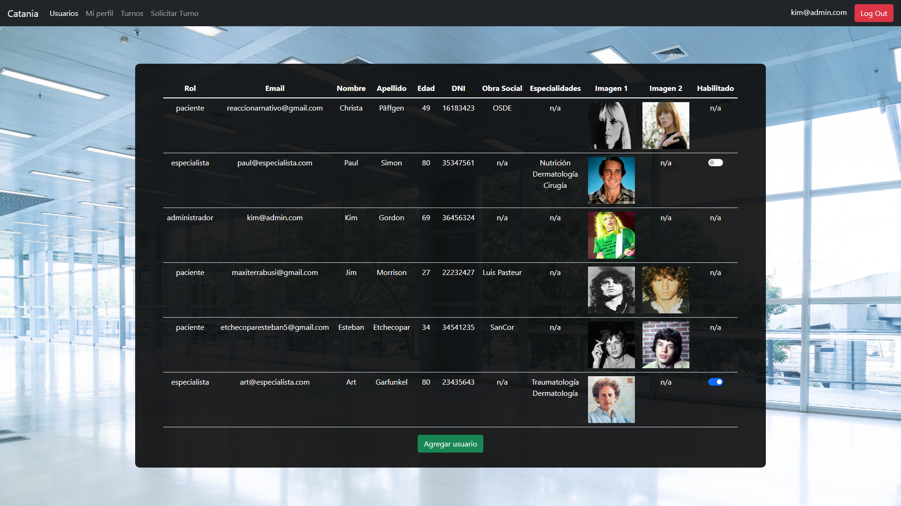

# :hospital: Clínica OnLine

Para quienes busquen brindar un servicio moderno, con llegada al gran público,
de forma novedosa e innovadora, presentamos la **Clínica OnLine**:

Un sistema de administración de instituciones dedicadas a la Salud, que te permitirá destacarte no sólo
por la calidad de tu atención profesional, si no también por una gustosa experiencia de usuario tanto
para pacientes como para empleados.

## Secciones

**Primero se ingresa al sistema.**

Una vez dentro, las diferentes secciones aquí expuestas son fácilmente accesibles a través del menú,
visible a lo largo de toda la aplicación.

Cada tipo de usuario cuenta con un acceso personalizado acorde a su rol.

### :heavy_check_mark: Página de bienvenida

### :heavy_check_mark: Registro

Para **pacientes y especialistas.**

Luego de registrarse, los pacientes deben verificar su correo electrónico
para poder ingresar por primera vez.

Ejemplo:

### :heavy_check_mark: Login

Brinda acceso a pacientes, especialistas y administradores por igual,
siempre y cuando se encuentren verificados / habilitados.

### :heavy_check_mark: Solicitar turno

Diseñada para que los pacientes puedan pedir turno en 3 simples pasos.

Los administradores también pueden solicitar turno en nombre de algún paciente
que así lo desee.

### :heavy_check_mark: Turnos / Mis turnos

Aquí, pacientes y especialistas pueden ver sus turnos pendientes y realizados, al detalle.

Los administradores pueden ver **todos** los turnos de la clínica.

Además, desde esta sección se van a poder administrar los turnos reservados.

Cualquier usuario puede, por ejemplo, **cancelar un turno** explicando el motivo:

### :heavy_check_mark: Mi perfil

Muestra la información personal del usuario logeado.

### :heavy_check_mark: Usuarios

En esta sección, los administradores (y sólo los administradores) pueden ver información
acerca de todos los usuarios, habilitar o deshabilitar el acceso a especialistas...

...y generar nuevos usuarios de cualquier tipo:

### :heavy_check_mark: Conclusión

Todo esto y mucho más es posible.

Cambia la manera en que figuras en internet hoy.
